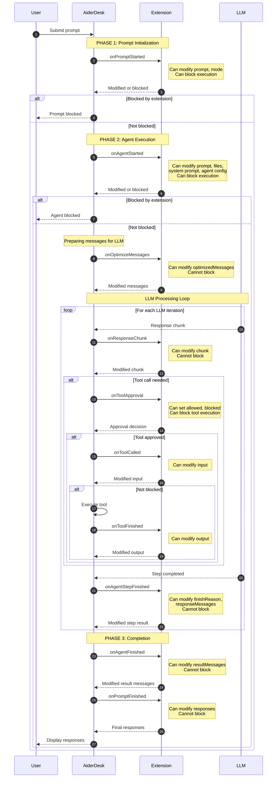

# Event Flow Guide

This guide shows you when extension events fire during prompt execution and which events to implement for specific use cases. Use this to understand where your extension can intercept, modify, or enhance the prompt processing flow.

## runPrompt Flow Overview

The following diagram shows the complete flow with all extension events:



## Event Details by Phase

### Phase 1: Prompt Initialization

**onPromptStarted** - First event fired when user submits a prompt

- **Can modify**: `prompt`, `mode`, `promptContext`
- **Can block**: ✅ Yes
- **Use for**:
  - Filter inappropriate content
  - Add prefixes/suffixes to prompts
  - Validate prompts before processing

### Phase 2: Agent Execution

**onAgentStarted** - Before the agent begins processing

- **Can modify**: `prompt`, `contextFiles`, `systemPrompt`, `agentProfile`, `providerProfile`, `model`
- **Can block**: ✅ Yes
- **Use for**:
  - Inject project-specific context
  - Modify system prompts
  - Change agent configuration

**onOptimizeMessages** - After messages are optimized for the LLM

- **Can modify**: `optimizedMessages`
- **Can block**: ❌ No
- **Use for**:
  - Control token usage
  - Remove sensitive data from history
  - Add additional context

### Phase 2b: LLM Processing Loop

These events fire during each iteration of the LLM processing:

**onResponseChunk** - For each response chunk

- **Can modify**: `chunk`
- **Can block**: ❌ No
- **Use for**: Real-time response modification

**onToolApproval** - When a tool requires approval

- **Can modify**: `allowed`, `blocked`
- **Can block**: ✅ Yes (via `allowed`)
- **Use for**: Auto-approve safe tools

**onToolCalled** - Before tool execution

- **Can modify**: `input`
- **Can block**: ❌ No (use `onToolApproval` instead)
- **Use for**: Prevent dangerous tool calls, modify inputs

**onToolFinished** - After tool execution

- **Can modify**: `output`
- **Can block**: ❌ No
- **Use for**: Format tool outputs, add metadata

**onAgentStepFinished** - After each LLM step

- **Can modify**: `finishReason`, `responseMessages`
- **Can block**: ❌ No
- **Use for**: Control iteration behavior

### Phase 3: Completion

**onAgentFinished** - After agent completes

- **Can modify**: `resultMessages`
- **Can block**: ❌ No
- **Use for**: Post-process final messages

**onPromptFinished** - Final event before returning to user

- **Can modify**: `responses`
- **Can block**: ❌ No
- **Use for**: Final response processing

## Quick Reference: Which Event Should I Use?

### Want to Modify or Filter Prompts?

| Event | When to Use | Can Block? |
|-------|------------|------------|
| `onPromptStarted` | Modify user's prompt text before processing, filter inappropriate content, add prefixes/suffixes | ✅ Yes |
| `onAgentStarted` | Modify prompt, context files, or system prompt before agent execution | ✅ Yes |
| `onOptimizeMessages` | Modify message history sent to LLM (e.g., remove sensitive data, add context) | ❌ No |

### Want to Customize Prompt Templates?

| Event | When to Use | Can Block? |
|-------|------------|------------|
| `onPromptTemplate` | Customize or override prompt templates (system prompts, init-project, etc.) before they're rendered | ❌ No |

### Want to Control Tool Execution?

| Event | When to Use | Can Block? |
|-------|------------|------------|
| `onToolApproval` | Control which tools require user approval, auto-approve safe tools | ✅ Yes (via `allowed`) |
| `onToolCalled` | Modify tool inputs before execution, prevent specific tool calls | ❌ No |
| `onToolFinished` | Modify tool outputs after execution, add metadata, format results | ❌ No |

### Want to Modify Responses?

| Event | When to Use | Can Block? |
|-------|------------|------------|
| `onResponseChunk` | Modify streaming response chunks in real-time | ❌ No |
| `onAgentStepFinished` | Modify step results, control iteration behavior | ❌ No |
| `onAgentFinished` | Modify final result messages before returning to user | ❌ No |
| `onPromptFinished` | Post-process all responses before display | ❌ No |

### Want to Enhance Context?

| Event | When to Use | Can Block? |
|-------|------------|------------|
| `onFilesAdded` | Filter or add files when user adds them to context | ✅ Yes |
| `onFilesDropped` | Control what files can be dropped into chat | ✅ Yes |
| `onRuleFilesRetrieved` | Modify which rule files (AGENTS.md, etc.) are loaded | ❌ No |
| `onImportantReminders` | Add custom reminders to user messages | ❌ No |

### Want to Handle Task/Project Lifecycle?

| Event | When to Use | Can Block? |
|-------|------------|------------|
| `onTaskCreated` | Initialize task-specific data, validate task creation | ❌ No |
| `onTaskPrepared` | Run setup logic when task is prepared (new or loaded) | ❌ No |
| `onTaskInitialized` | Execute code when task is ready for use | ❌ No |
| `onTaskClosed` | Cleanup when task is closed | ❌ No |
| `onProjectStarted` | Initialize project-level resources | ❌ No |
| `onProjectStopped` | Cleanup project-level resources | ❌ No |

## Common Use Cases with Examples

### 1. Add Custom Context to All Prompts

Implement `onAgentStarted` to inject project-specific context:

```typescript
async onAgentStarted(event: AgentStartedEvent, context: ExtensionContext): Promise<Partial<AgentStartedEvent>> {
  // Add project guidelines to system prompt
  const guidelines = await loadProjectGuidelines(context.getProjectDir());

  return {
    systemPrompt: event.systemPrompt + '\n\n' + guidelines
  };
}
```

### 2. Prevent Dangerous Operations

Implement `onPromptStarted` to block dangerous commands:

```typescript
async onPromptStarted(event: PromptStartedEvent, context: ExtensionContext): Promise<Partial<PromptStartedEvent>> {
  const dangerousPatterns = ['rm -rf', 'DROP TABLE', 'format disk'];

  if (dangerousPatterns.some(pattern => event.prompt.includes(pattern))) {
    context.log('Blocked dangerous prompt', 'warning');
    return { blocked: true };
  }

  return {};
}
```

### 3. Auto-Approve Safe Tools

Implement `onToolApproval` to auto-approve read-only tools:

```typescript
async onToolApproval(event: ToolApprovalEvent, context: ExtensionContext): Promise<Partial<ToolApprovalEvent>> {
  const readOnlyTools = ['file_read', 'semantic_search', 'glob', 'grep'];

  if (readOnlyTools.includes(event.toolName)) {
    context.log(`Auto-approving safe tool: ${event.toolName}`, 'info');
    return { allowed: true };
  }

  return {};
}
```

### 4. Filter Files Added to Context

Implement `onFilesAdded` to prevent sensitive files from being added:

```typescript
async onFilesAdded(event: FilesAddedEvent, context: ExtensionContext): Promise<Partial<FilesAddedEvent>> {
  const filtered = event.files.filter(file =>
    !file.path.includes('.env') &&
    !file.path.includes('secrets') &&
    !file.path.includes('credentials')
  );

  if (filtered.length !== event.files.length) {
    context.log(`Filtered ${event.files.length - filtered.length} sensitive files`, 'info');
  }

  return { files: filtered };
}
```

### 5. Enhance Tool Outputs

Implement `onToolFinished` to add metadata or format results:

```typescript
async onToolFinished(event: ToolFinishedEvent, context: ExtensionContext): Promise<Partial<ToolFinishedEvent>> {
  if (event.toolName === 'file_read' && typeof event.output === 'string') {
    // Add line numbers to file contents
    const lines = event.output.split('\n');
    const numbered = lines.map((line, i) => `${i + 1}|${line}`).join('\n');

    return { output: numbered };
  }

  return {};
}
```

### 6. Add Custom Reminders

Implement `onImportantReminders` to inject custom instructions:

```typescript
async onImportantReminders(event: ImportantRemindersEvent, context: ExtensionContext): Promise<Partial<ImportantRemindersEvent>> {
  const customReminders = `
## Project-Specific Rules
- Always use TypeScript strict mode
- Follow the existing code style in each file
- Add unit tests for new functions
`;

  return {
    remindersContent: event.remindersContent + customReminders
  };
}
```

### 7. Optimize Message History

Implement `onOptimizeMessages` to control token usage:

```typescript
async onOptimizeMessages(event: OptimizeMessagesEvent, context: ExtensionContext): Promise<Partial<OptimizeMessagesEvent>> {
  // Keep only last 20 messages to reduce tokens
  const maxMessages = 20;
  const optimized = event.optimizedMessages.slice(-maxMessages);

  if (optimized.length < event.optimizedMessages.length) {
    context.log(`Trimmed ${event.optimizedMessages.length - optimized.length} old messages`, 'info');
  }

  return { optimizedMessages: optimized };
}
```

### 8. Validate Task Creation

Implement `onTaskCreated` to enforce naming conventions:

```typescript
async onTaskCreated(event: TaskCreatedEvent, context: ExtensionContext): Promise<Partial<TaskCreatedEvent>> {
  const task = event.task;

  // Auto-generate task name if missing
  if (!task.name || task.name.trim() === '') {
    const defaultName = `Task-${Date.now()}`;
    return {
      task: { ...task, name: defaultName }
    };
  }

  return {};
}
```

### 9. Customize Prompt Templates

Implement `onPromptTemplate` to customize prompt templates before they're rendered:

```typescript
async onPromptTemplate(event: PromptTemplateEvent, context: ExtensionContext): Promise<Partial<PromptTemplateEvent>> {
  // Customize the system prompt
  if (event.name === 'system-prompt') {
    const projectDir = context.getProjectDir();
    const customInstructions = `

## Project-Specific Guidelines
- This project uses TypeScript with strict mode
- Always prefer type-safe implementations
- Follow the existing code patterns
    `;

    return {
      prompt: event.prompt + customInstructions
    };
  }

  // Customize the init-project prompt
  if (event.name === 'init-project') {
    return {
      prompt: event.prompt.replace('[DEFAULT INSTRUCTIONS]', '[CUSTOM PROJECT INSTRUCTIONS]')
    };
  }

  return {};
}
```

## Event Execution Order

### During Prompt Execution

```
1. onPromptStarted          ← First chance to modify/block prompt
2. onAgentStarted           ← Modify agent configuration
3. onOptimizeMessages       ← Modify message history
4. [LLM Processing Loop]
   4a. onResponseChunk      ← Modify each response chunk
   4b. onToolApproval       ← Control tool execution
   4c. onToolCalled         ← Modify tool inputs
   4d. onToolFinished       ← Modify tool outputs
   4e. onAgentStepFinished  ← Modify step results
5. onAgentFinished          ← Modify final messages
6. onPromptFinished         ← Last chance to modify responses
```

### During File Operations

```
1. onFilesAdded             ← Filter files added via command
2. onFilesDropped           ← Filter files dropped in UI
3. onRuleFilesRetrieved     ← Modify rule files loaded
```

### During Task Lifecycle

```
1. onTaskCreated            ← Task just created
2. onTaskPrepared           ← Task prepared (new or loaded)
3. onTaskInitialized        ← Task ready for use
4. [Task execution...]
5. onTaskUpdated            ← Task data modified
6. onTaskClosed             ← Task closing
```

### During Project Lifecycle

```
1. onProjectStarted         ← Project opened
2. [Tasks created/used...]
3. onProjectStopped         ← Project closed
```

## Blocking vs Non-Blocking Events

### Events That Can Block Execution

These events allow you to prevent an action by returning `{ blocked: true }`:

- ✅ `onPromptStarted` - Block prompt execution
- ✅ `onAgentStarted` - Block agent execution
- ✅ `onToolApproval` - Block tool (by not approving)
- ✅ `onFilesAdded` - Block files from being added (return empty array)
- ✅ `onFilesDropped` - Block files from being dropped (return empty array)
- ✅ `onHandleApproval` - Block approval handling
- ✅ `onSubagentStarted` - Block subagent spawning
- ✅ `onCustomCommandExecuted` - Block custom command
- ✅ `onAiderPromptStarted` - Block Aider prompt

### Events That Cannot Block

These events can only modify data, not prevent execution:

- ❌ `onOptimizeMessages` - Can only modify messages
- ❌ `onResponseChunk` - Can only modify chunks
- ❌ `onAgentStepFinished` - Can only modify step results
- ❌ `onToolFinished` - Can only modify tool output
- ❌ `onAgentFinished` - Can only modify result messages
- ❌ `onPromptFinished` - Can only modify responses
- ❌ All task/project lifecycle events

## Extension Context Capabilities

Your extension receives an `ExtensionContext` object that provides safe access to AiderDesk:

### Available in All Events

```typescript
context.log(message, 'info' | 'error' | 'warn' | 'debug')  // Log messages
context.getProjectDir()                                      // Get project path
context.getProjectContext()                                  // Access project operations
context.getModelConfigs()                                    // Get available models
context.getSetting('key.path')                              // Get setting value
context.updateSettings({ ... })                             // Update settings
```

### Available in Task-Related Events

```typescript
const task = context.getTaskContext()
if (task) {
  // Read task data
  task.data                              // Task metadata
  await task.getContextFiles()           // Get context files
  await task.getContextMessages()        // Get message history

  // Modify task
  await task.addFile(path, readOnly)     // Add file to context
  await task.dropFile(path)              // Remove file from context
  await task.updateTask({ name: '...' }) // Update task data

  // Execute operations
  await task.runPrompt(prompt, mode)     // Run a prompt
  await task.runCommand(command)         // Execute command
  await task.interruptResponse()         // Stop current execution

  // User interaction
  await task.askQuestion('Continue?', {
    answers: [{ text: 'Yes', shortkey: 'y' }]
  })
  task.addLogMessage('info', 'Processing...')
}
```

## Tips for Extension Developers

1. **Use Blocking Sparingly**: Only block when absolutely necessary. Blocking prevents users from completing their work.

2. **Log Your Actions**: Always use `context.log()` to help users understand what your extension is doing.

3. **Handle Errors Gracefully**: Wrap your logic in try-catch and log errors instead of crashing.

4. **Return Empty Objects**: If you don't need to modify an event, return `{}` instead of nothing.

5. **Check Context Availability**: Always check if `getTaskContext()` returns null before using it.

6. **Respect User Intent**: Don't completely rewrite user prompts without good reason.

7. **Test Blocking Logic**: Make sure your blocking conditions are well-tested to avoid false positives.

8. **Document Your Extension**: Clearly document which events your extension uses and why.

## See Also

- [Events Reference](./events.md) - Complete event documentation
- [API Reference](./api-reference.md) - Full type definitions
- [Extensions Gallery](./extensions-gallery.md) - Browse example extensions for inspiration and check out production-ready extensions
- [Creating Extensions](./creating-extensions.md) - Step-by-step tutorial